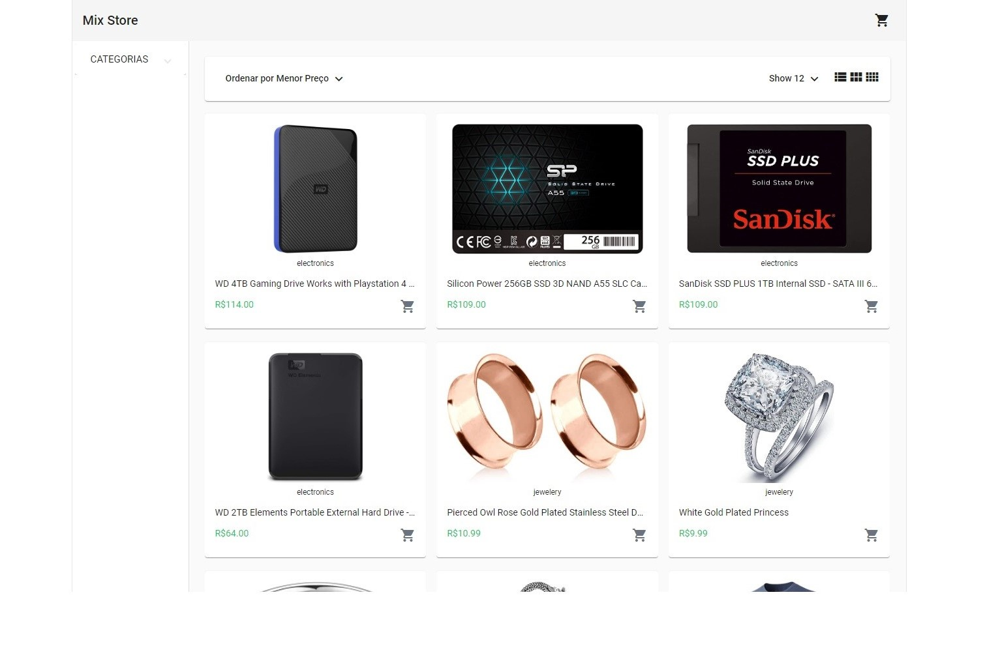

# Mix Store

Uma loja de variedades fictícia feita com Angular, Typescript e Node :D


## Visite o Site

O site está atualmente hospedado na Vercel e pode ser acessado através do seguinte link:

* https://mix-store-eta.vercel.app/home




### Funcionalidades

- Filtragem por Categorias: Os usuários podem facilmente encontrar produtos específicos ao filtrar por categorias
- Ordenação por Preço: Os produtos podem ser organizados de forma ascendente ou descendente com base no preço
- Personalização da Visualização: Os usuários podem escolher entre diferentes layouts de exibição para os produtos na tela
- Consumo de API: Uso de API externa para fornecer os produtos disponíveis para compra, garantindo uma seleção atualizada e dinâmica
- Carrinho de Compras: Os usuários podem adicionar, remover e visualizar itens em seu carrinho de compras antes de finalizar a compra
- Checkout com Stripe**: Integração segura e eficiente com o Stripe para processar pagamentos de forma rápida e fácil

** por ser um projeto somente para fins educacionais, não é possível finalizar a compra, foi utilizado o stripe no modo teste/desenvolvimento.

### Melhorias além do proposto no tutorial

- Responsividade mínima para Telas Mobile: O website é minimamente responsivo, proporcionando uma experiência agradavel em dispositivos móveis
- Utilização do Nodemon: Permite a visualização das alterações em tempo real no código durante o desenvolvimento.
- Revisão de Código: Boas praticas, remoção de conteudo não utilizado e adição de comentários pertinentes.
- Hospedagem online na Vercel

### Bibliotecas utilizadas

- [angular](https://angular.io/)
- [typescript](https://www.typescriptlang.org/)
- [node.js](https://nodejs.org/en)
- [angular material](https://material.angular.io/)
- [nodemon](https://www.npmjs.com/package/nodemon)
- [stripe](https://stripe.com/br)
- [fake store API](https://fakestoreapi.com/)

## Como Instalar e Executar o Projeto na Sua Máquina

### Passo 1 - Requisitos

Você vai precisar de:

- [git](https://git-scm.com/)
- [node.js](https://nodejs.org/en)
- [angular-cli](https://angular.io/cli)
- [npm packages](https://www.npmjs.com/)

### Passo 2 - Clone o repositório

```sh
$ git clone https://github.com/mylenaverspeelt/mix-store.git
```

### Passo 3 - Rode a aplicação

- Certifique de estar na pasta raiz do projeto

```sh
cd mix-store
```
- Instale as  as dependências do projeto

```sh
npm install
```

- Inicie o servidor Angular

```sh
ng serve
```

O projeto estará disponível em localhost:4200

##### Simultaneamente, abra outro terminal
- Navegue até a pasta do servidor

```sh
cd mix-store/server
```

- Inicie o servidor Node.js

```sh
nodemon server.js
```
O servidor estara rodando em localhost:4242

### Links originais

Este projeto foi desenvolvido com base no tutorial oferecido pela FreeCodeCamp. Você pode assistir e acessar o repositorio original nos seguintes links:

- https://www.youtube.com/watch?v=Kbauf9IgsC4
- https://github.com/bobangajicsm/E-Commerce-Store

